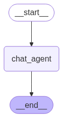
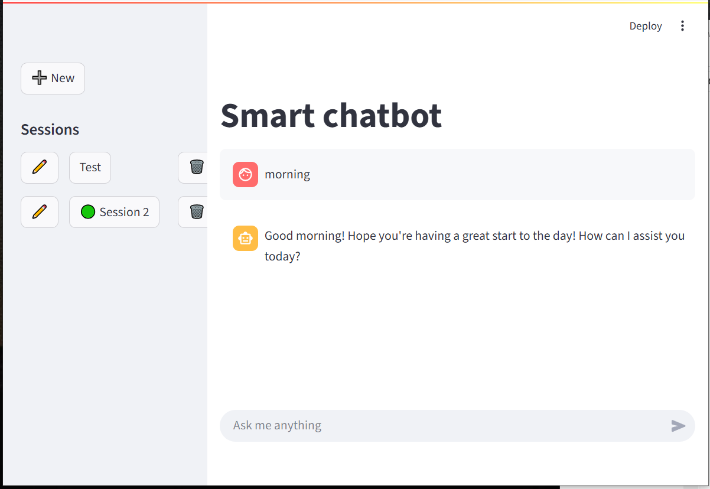

# Smart AI Agent build with LangGraph, FastAPI, SQLite and Streamlit

Build a chatbot from scratch with LangGraph, FastAPI & Streamlit. 
The conversation flows will be managed with LangGraph and we will use FastAPI to serve the chatbot endpoint. The Streamlit UI will be used to interact with the backend API.

Sessions are persisted and fetched from the backend via a SQLite database.

### Agent Graph 


### Frontend
The UI will be chatGPT-like UI:



ToDo:
- ...


Done:
 - Sessions hitory in the sidebar
 - Add a loading spinner while waiting for ai response
 - Can create/rename/delete sessions from the frontend
 - Persist sessions names

### Backend

ToDo:
 - Add tools: web-search, etc.
 - ...


Done:
 - Agent graph and workflow
 - FastAPI backend endpoints
 - Persist sessions in a SQLite database
 - Can delete session from the frontend

### How to run

 - In the first terminal

 ```
  git clone https://github.com/DamVinho/smart_ai_agent.git
  cd smart_ai_agent/backend
  uvicorn api.main:app --reload
 ```
 
 - In a second terminal
 
 ```
  streamlit run frontend/chatbot_ui.py
 ```

 [Link for Emojis](https://emojikeyboard.top/fr/)